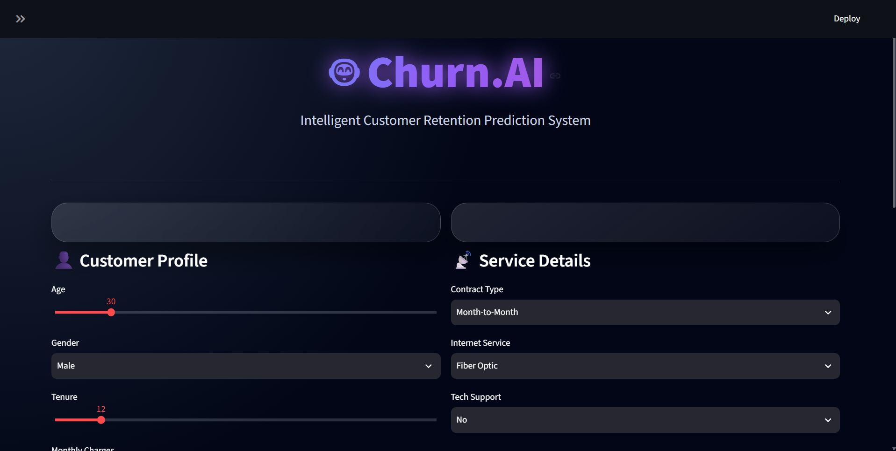
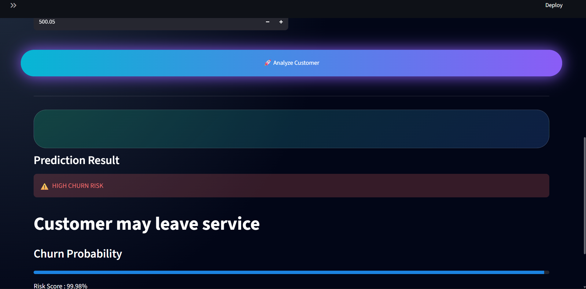
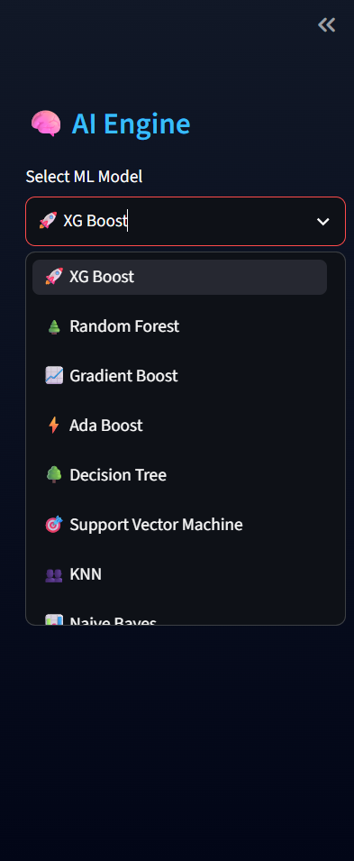
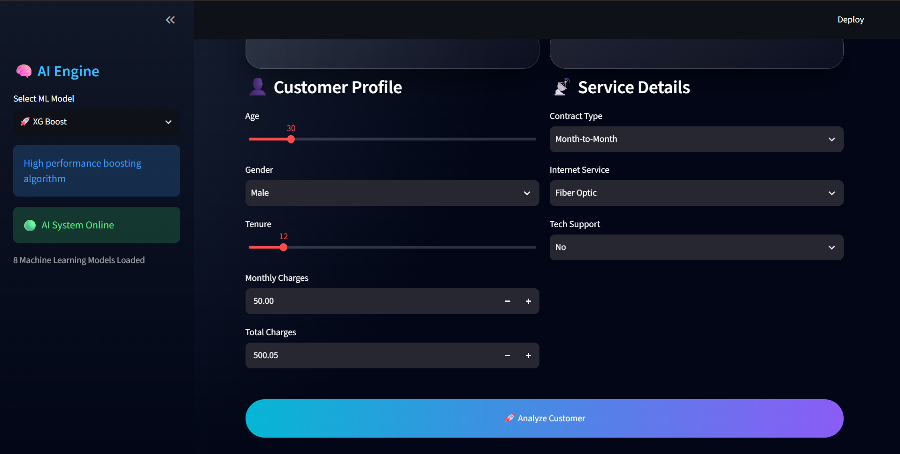

# 🤖 Churn.AI

AI-powered Customer Churn Prediction System using Machine Learning.

## 📌 Overview

Churn.AI predicts whether a customer is likely to leave a service using multiple Machine Learning algorithms.

## 🚀 Features

- Multiple ML model selection
- XGBoost prediction
- Random Forest prediction
- Churn probability estimation
- Interactive Streamlit dashboard
- Modern AI-based UI


## 📸 Screenshots


### Dashboard




### Prediction




### Models 




### Entries 




## 🛠 Technologies

- Python
- Pandas
- Scikit-learn
- XGBoost
- Streamlit


## ▶️ Run Locally

```bash
pip install -r requirements.txt

streamlit run app.py
